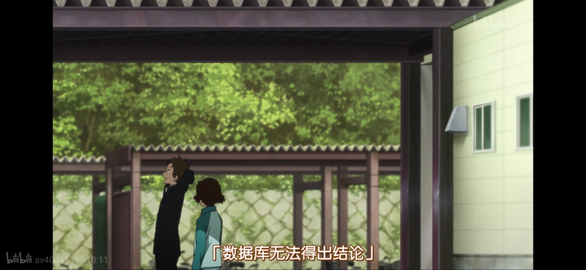

## A DataBase that Draws No Conclusions

**DBNoC** (A **D**ata**B**ase that Draws **No** **C**onclusions, dee-bee-knock) is the course project for Introduction to Database Management Systems (数据库系统概论), Fall 2019, Tsinghua University. It is a simple relational database that supports basic SQL statements.

This project is named after **Fukube Satoshi's famous lines** (as illustrated below) in the Japanese anime, *Hyouka* (氷菓), **to salute those who passed away in [Kyoto Animation arson attack](https://en.wikipedia.org/wiki/Kyoto_Animation_arson_attack), those young men who lost their names in the 1960s/70s, and those who endured "the endless everyday"** (終わらない日常).



### Usage

```
cd src
make
```

Use ```./sm/create [database]``` and ``` ./sm/drop [database] ``` to create/drop databases.

Use ``` ./use [database] ``` to open databases.

### Supported Statements

- ```create table ... (... [not null] [primary key] [foreign key ... references ...(...)] [default ...])```
- ```drop table ...```
- ```show```
- ```alter table ... add primary key (...)```
- ```alter table ... drop primary key```
- ```alter table ... add foreign key (...) references ...(...)```
- ```alter table ... drop foreign key ...```
- ```alter table add ... not null default ...```
- ```alter table drop ...```
- ```insert into ...(...) values (...)```
- ```delete from ... where ... [and ...]```
- ```update ... set ... = ...```
- ```select ... from ... where ... [and ...]```

### Optimization

- There is a simple optimization when the ```where``` clause has constraints like ```a.col1 == b.col2``` with indexes on both columns.

### Reference

- [Redbase Project](https://web.stanford.edu/class/cs346/2015/redbase.html)
